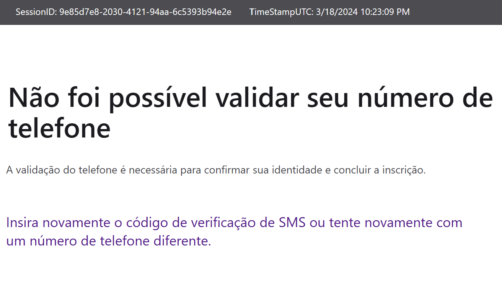
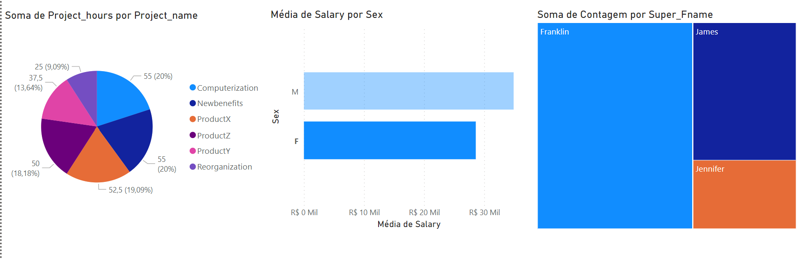

<h1>
    
    Python Data Analytics

</h1>

# :computer: Desafio de projeto: 

## Processando e Transformando Dados com Power BI

### Instruções de Entrega do Desafio

As instruções para o projeto estão no arquivo:

"Desafio de Projeto - Processando e Transformando Dados com Power BI - Instruções.docx"

# :bulb: Solução do desafio

A primeira parte do desafio consistia em criar um conta no azure, popular o banco de dados e integrar com o power BI. Porém a página do azure dá erro na verificação de telefone e não foi possível iniciar o período de testes.

Então instalei e configurei o mariaDB para realizar o desafio.

Houveram problemas quanto à conexão com o power BI, o aplicativo disponível pelo site do mariaDB não conseguia fazer a integração.

Então segui os passos do tutorial:
https://community.fabric.microsoft.com/t5/Power-Query/Connect-MaridDB-to-Power-Bi/m-p/635928#M22080

Em que instalei o conector do MySQL com o driver ODBC e configurei a conexão. 

No power BI, em get data, selecionei a opção OBDC e escolhi o banco de dados que configurei. O banco de dados e tabelas foram criados usando o Workbench, com as queries "script_bd_company.sql" e "insercao_de_dados_e_queries_sql.sql" adaptados do Modulo3/desafio de projeto de:
 https://github.com/julianazanelatto/power_bi_analyst

* Transformação dos dados com o Power Query

- Valores de salary de employee convertidos para decimal fixo.

- employee James com Super_ssn null, ele é o gerente do headquartes, portando o dado não será removido.

- Todos os departamentos possuem gerentes.

- Na tabela works_on se encontram as horas de cada employee por projeto. O manager James possui 0 Horas no projeto 20.

- tabelas employee e department mescladas como nova consulta (employee2) usando, respectivamente, colunas Dno e Dnumber. 

- tabelas employee2 e employee mescladas internamente usando, respectivamente, colunas Super_ssn e Ssn. Usei somente a coluna Fname. O employee James (que é gerente) foi removido por não ter supervisor.

- Mesclei as colunas Fname, Minit, e Lname em uma Coluna Full_name com separador de espaço.

- Expandi a tabela dept_location somente com Dlocation e mesclei a coluna Dname com Dlocation usando o separador - em uma nova coluna de nome Departamento-Local

- Dados agrupador por Super_Fname, contagem de linhas: nos dá o números de empregados por gerente 

- Eliminei as colunas:  Ssn, Bdate, Address, Super_ssn, department, dependent e works_on e renomeei a consulta para employee-department

- criei uma nova consulta (employee-project) com mesclagem interna usando employee Ssn e works_on Essn, deletei colunas desnecessárias mantendo project name e project hours.

- Fiz 3 gráficos para visualizar os dados
    - Número de horas por projeto (pizza)
    - Média salarial por genero (barra)
    - Número de employee por supervisor (treemap)

Os gráficos e o projeto encontra-se no arquivo:

projetoDIOprocTransDadosPowerBI.pbix

